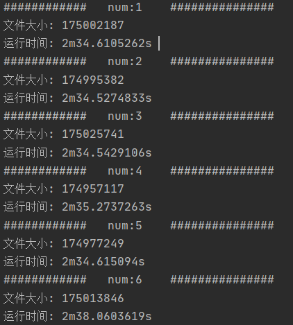
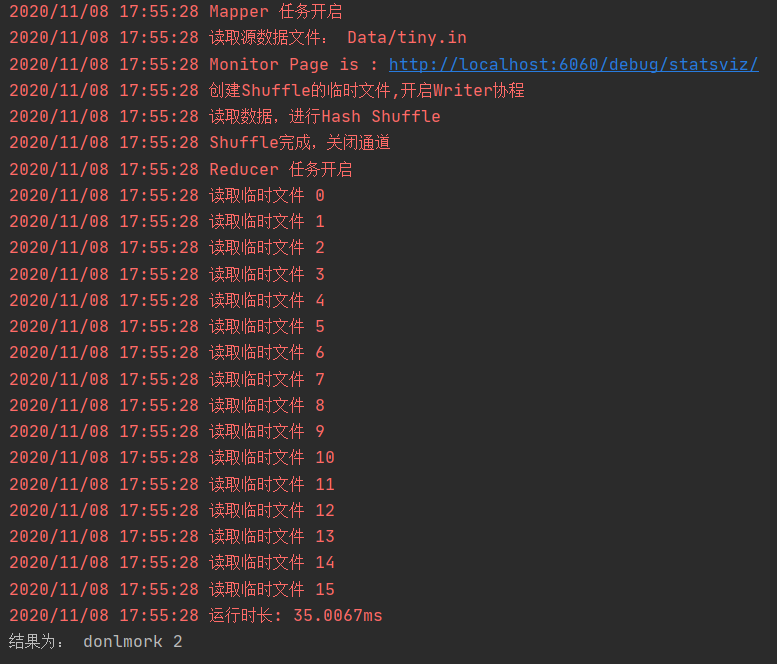
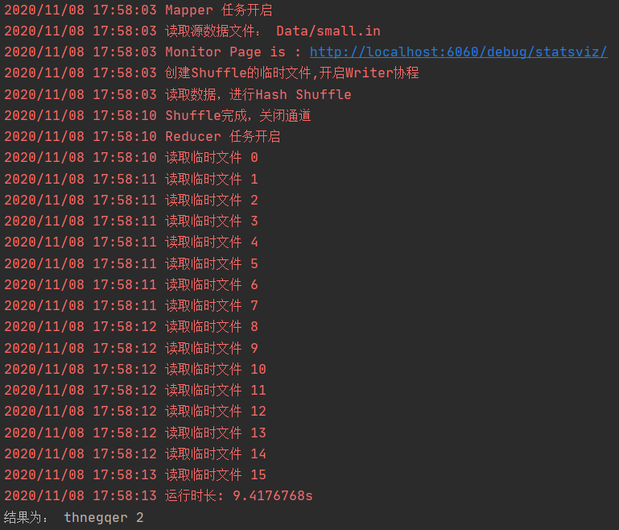
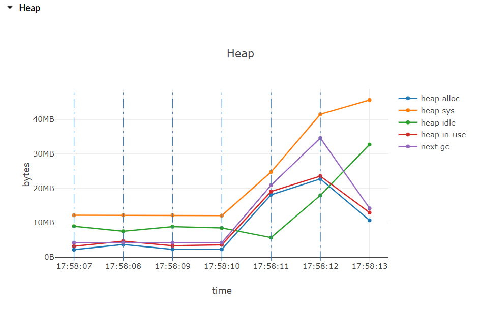
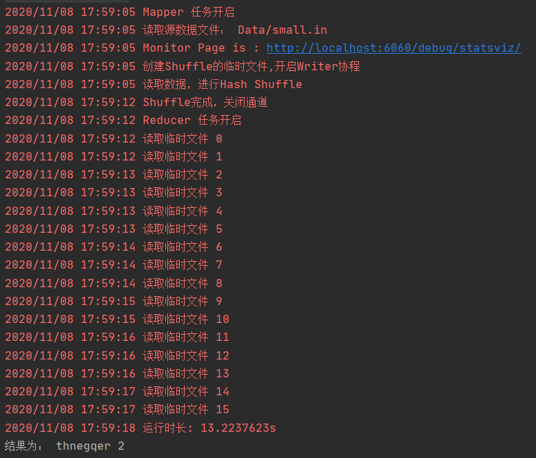
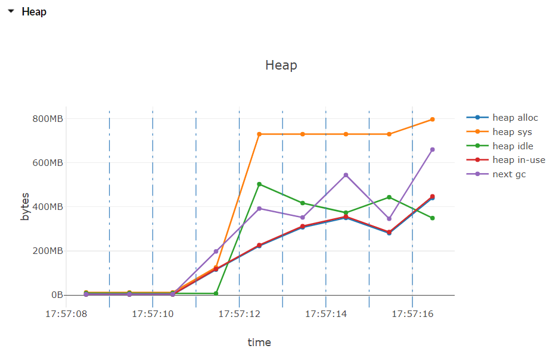
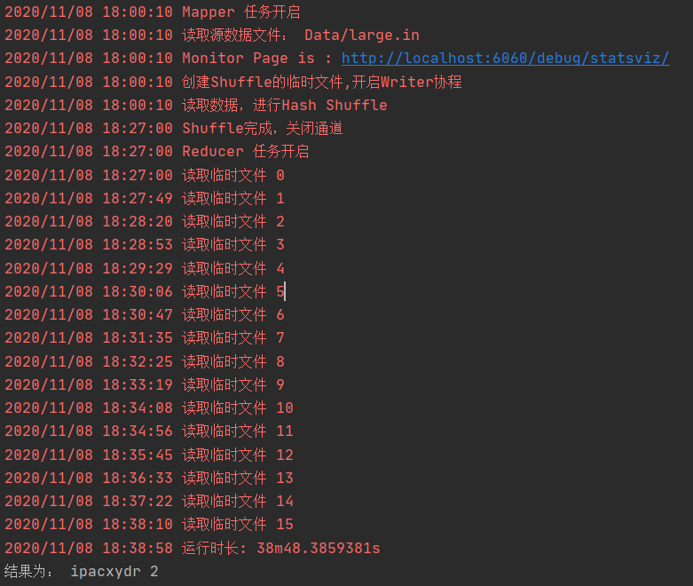
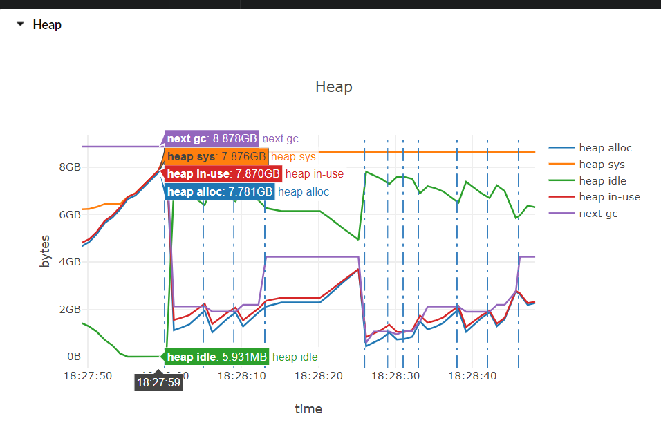
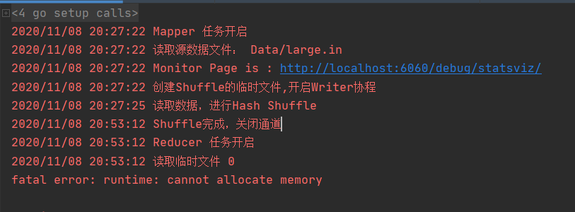
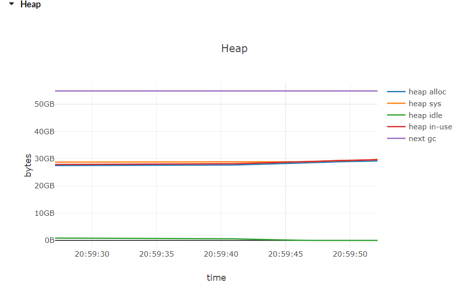

# PingCap 笔试题 by JJZ
## 题目描述
有一个 100GB 的文件，里面内容是文本，要求：找出第一个不重复的词；只允许扫一遍原文件；尽量少的 IO；内存限制 16G

## 思路历程

- 海量的数据查询，最开始想到的是布隆过滤器，但是布隆没有办法来记录第一次出现的位置。所以需要其他的东西来记录。除此之外，布隆还有误判该单词在布隆过滤器的问题。
- 第二个想法是使用Trie树和HashMap。流式地读取数据，但内存有限，所以要对100G的源数据进行分块处理。
- 联想到大数据的相关知识，海量数据处理可以使用MapReduce编程模型。所以整个问题就变成了MapReduce的word count，只不过是需要额外记录一下单词第一次出现的位置
- MapReduce的编程模型更加通用，流程更复杂。针对本问题可以进行简化。类似于Spark Shuffle的Aggregator机制，我们可以吧Map阶段和Reduce阶段的排序等过程省去，提高效率。
- 除此之外，需要计算下数据量，来决定Shuffle阶段的数据切割个数，如下图所示，1千万个长度为1-64位的单词写入到文件大约是175MB。故100G的数据大约有585千万个单词。
  
- 设置一个结构体，作为Map的Value值，而且不需要考虑字节对齐，因为go的Map是使用数组来存储的。 所以GO的Map的大小大约为，`map_len * 8 * (key_size,value_size)` .但是由于数据可能有重复，在不考虑数据倾斜和其他程序占用内存的情况下估算的话：
  100G的单词（平均长度32Bytes）+uint64类型索引和出现次数（16Bytes） ≈ 250G。
  250G/16G  ≈ 16 个分块数
  故shuffle时，要生成16个临时文件。

## 方法：
1. 生成数据，写入到input.in文件。
2. Map阶段：读取数据 -> 通过Hash值取模，并发shuffle到分块的临时文件
3. Reduce阶段：读取临时文件 -> 解析出KV -> 数据刷新到collection中-> 遍历collection找到只出现了一次且第一次出现索引最小的单词 -> 对比当前最小值，输出结果

Collection是我自己定义的结构，目前有两种实现方法，Map和Trie

## 输出结果
#### 电脑配置
- CPU: AMD Ryzen 7 pro 4750U 8核16线程 1.7Ghz
- 内存： 16G 3200MHz
- 磁盘： 三星 PM981a SSD
- Go : go version go1.15 windows/amd64

*注：此处的MapReduce是指，Reduce在存储键值的时候，使用的是go语言的内置的Map*

#### Tiny数据集：1w个单词
##### MapReduce

##### TrieReduce

#### Small数据集：500w个单词  87MB
##### MapReduce

##### TrieReduce

#### Large数据集：10亿个单词  16GB
##### MapReduce

##### TrieReduce

## 结论：
1. 通过Small和Tiny数据集可以产出，Trie树运算较慢，且需要的内存比map大很多。到Large数据集上，Trie树已经完全不能使用了。
2. Trie树的结构决定，字母的长度越长，树就越高，需要的空间和时间就越多。同时Trie树更适合有大量重复值的数据，比如日常生活中的文章等等。
